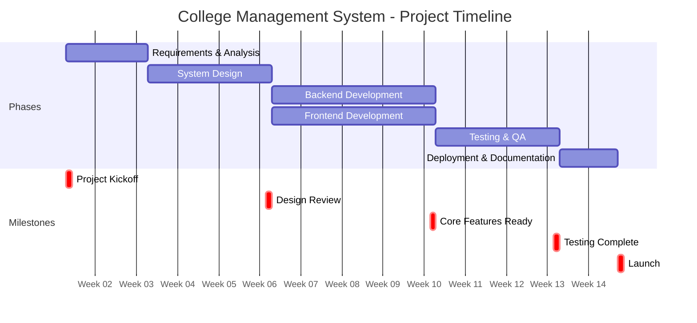
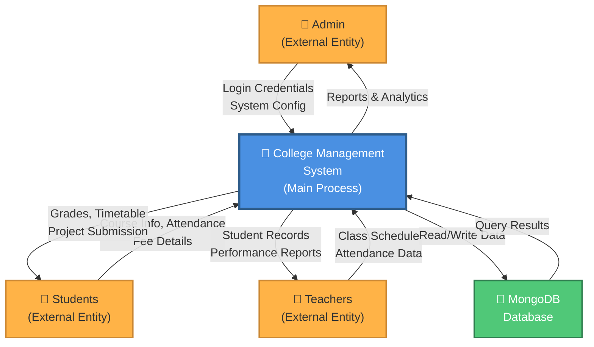
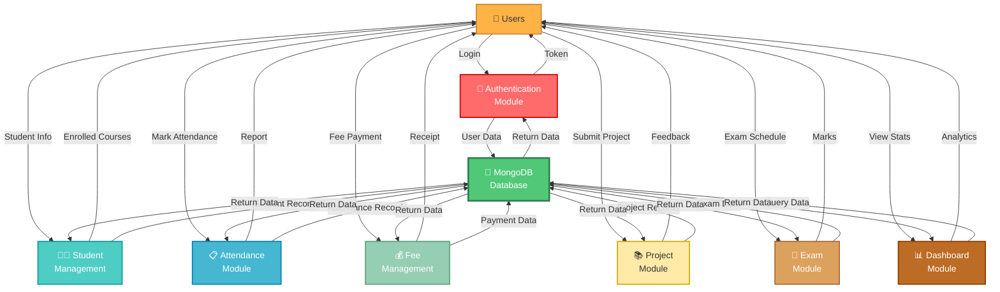
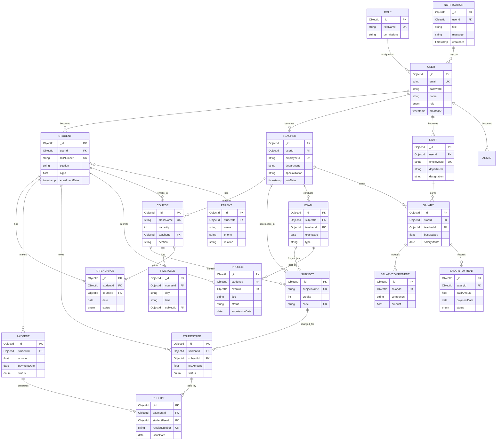
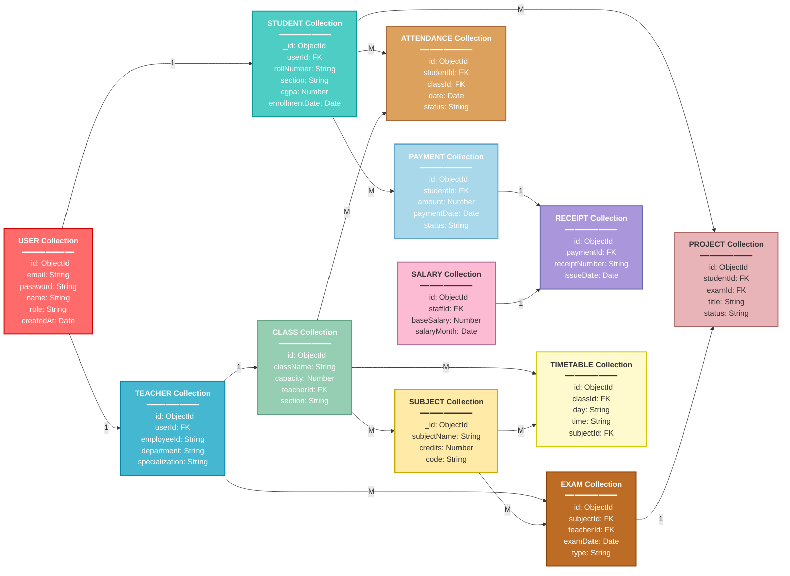
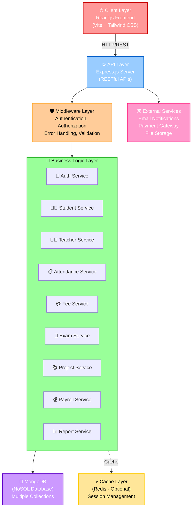
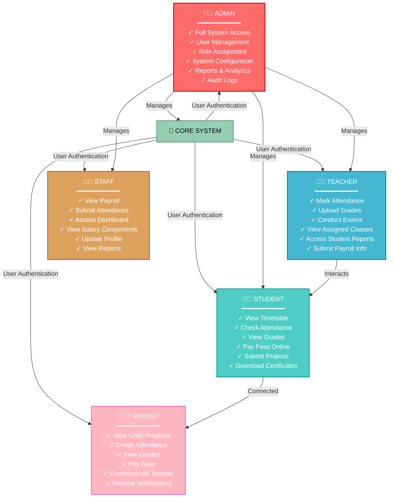

# Mermaid Diagram Codes - College Management System

All diagrams have been generated using Mermaid.js markup language. Use these codes to regenerate diagrams, export them, or modify them as needed.

---

## 1. GANTT CHART - Project Timeline

**File**: `01_gantt_chart.png`

---

## 2. DATA FLOW DIAGRAM - Level 0 (Context Diagram)

**File**: `02_dfd_level0.png`

---

## 3. DATA FLOW DIAGRAM - Level 1 (Detailed Modules)

**File**: `03_dfd_level1.png`

---

## 4. ENTITY RELATIONSHIP DIAGRAM (ER Diagram)

**File**: `04_er_diagram.png`

---

## 5. MONGODB COLLECTIONS SCHEMA & RELATIONSHIPS

**File**: `05_schema_diagram.png`

---

## 6. SYSTEM ARCHITECTURE - Three-Tier MERN Stack

**File**: `06_architecture.png`

---

## 7. USER ROLES & PERMISSION MATRIX

**File**: `07_roles_permissions.png`

---

## 🚀 How to Use These Codes

### Export as SVG:
1. Visit [mermaid.live](https://mermaid.live)
2. Paste code from above
3. Click "Download SVG" button
4. Save file with appropriate name

### Export as PNG:
1. Use mermaid.live and click "Download PNG"
2. Or use VS Code with Mermaid extension
3. Right-click diagram → "Save as image"

### Modify Diagrams:
- Edit colors by changing hex codes (e.g., `fill:#FF6B6B`)
- Change text in quoted strings
- Adjust connections by modifying arrows
- Add/remove entities or relationships

---

**All diagrams are ready for professional PDF integration!**
